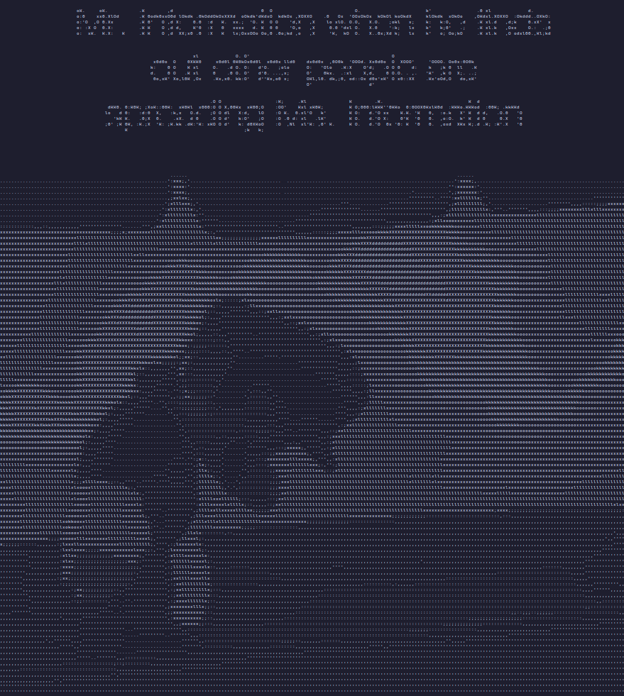

# Ascii Webcam/Video
~Scuffed video calls are also possible~



# How to use

## Webcam
Gui settings are available after running video.py
```
python video.py

# flags
-s [scale 0-1] -c [cam_index 0-9?] -t [table 0,1]

```
## Video Call
run client.py on 2 computers to connect, only a single call can happen at a time
```
python client.py

# flags
-s [scale 0-1]
-c [cam_index 0-9?]
```

## from image
```
python ascii.py image.png

# flags
-s [scale 0-1] -t [table 0,1]
```

## from video
```
python video.py -v video.mp4

# flags
-s [scale 0-1] -t [table 0,1]

```
